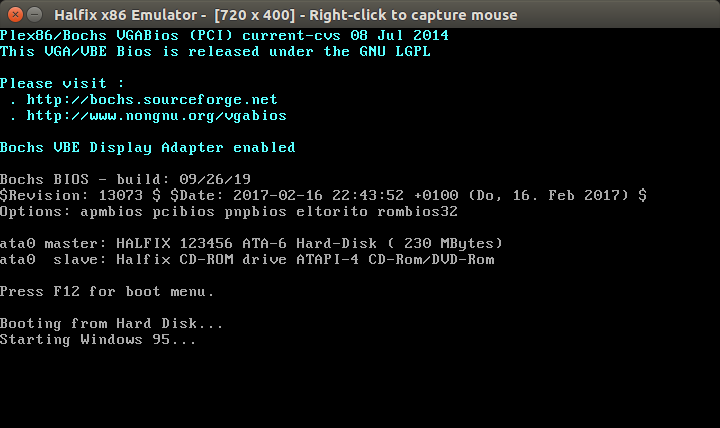
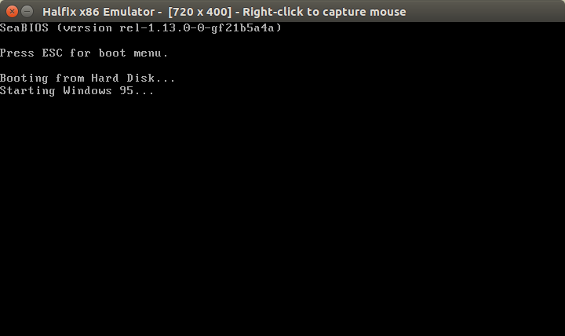
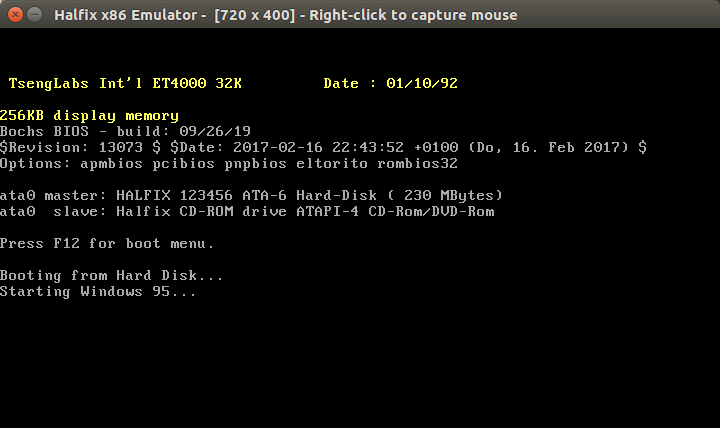
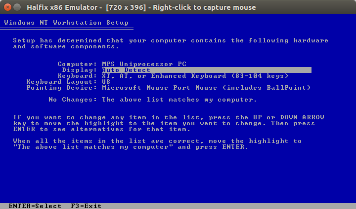

# Compatibility

Most operating systems work fine with the default configuration (32 MB RAM, no floppy drive, APIC/PCI/ACPI enabled). However, you might need to increase the RAM size or enable floppy drives. 

Note that some operating systems won't work in the browser version because support for disks larger than 4 GB haven't been implemented yet. 

## BIOS

The ones below work fine. I haven't tried any of the other ones. 

### Bochs BIOS
Works well, except a disk drive write delay bug. Patch is in `docs/rombios.patch`

### LGPL'ed VGABIOS
Works well, except Buildroot can't detect VESA

### SeaBIOS
Works with latest commits. Use with SeaVGABIOS for maximum compatibility. 

CD-ROM boots don't work yet because of bugs in the ATAPI emulation. 

### ET4000 ROM
Appears to work. Use in conjunction with Bochs BIOS. 

## DOS
All versions should work, although they might not boot from floppy disks due to unimplemented commands. Installing must be done on DOSBox or Bochs because swapping floppy disks is not supported. 

## Windows

### Windows 1.01
Boots from floppy disk image.

### Windows 2.02
Boots from floppy disk image.

### Windows 3.1
Boots from a 10 MB hard disk image. Mouse is laggy because it doesn't use `HLT`. 

### Windows 95
Boots from a 250 MB hard disk image. Works very well

### Windows 98 SE
Boots from a 300 MB hard disk image.

### Windows ME
Boots and runs. 

### Windows NT 4.0
Installs, boots, and runs. Very stable. Can self-virtualize if SP6 is installed. 

During install, **DON'T** let the installer auto-detect the video device! Manually change the VGA option by opening the following menu:

Pick the Standard VGA option. 

The emulated video card is based on the ET4000, so that's what it detects. Currently, none of the SVGA extensions are implemented, and Windows gets confused and switches the screen off. 

Disable Pentium 4 and Core Duo support in `src/cpu/ops/misc.c`. There's a well-known CPU detection bug that causes NT to triple fault during installation. You can re-enable higher-level CPU emulation after installation. 

### Windows 2000
Boots and runs. 

### Windows XP
Installs, boots, and runs. Very stable. I recommend running with 128 MB RAM, although 32 MB works fine too. 

### Windows Vista
Takes forever to boot with the Pentium 4 CPU configuration. Set IPS to around 50,000,000 to get the nice Aero theme. Run with 512 MB of RAM. 

### Windows 7
The disk image I created requires a Pentium 4 or better to boot (it hangs on a `#UD` exception on FXSAVE). Boots to desktop and is somewhat usable. Can't use CDs because not all commands are implemented. Run with 512 MB of RAM. 

### Windows 8
BSODs with a `KERNEL_DATA_INPAGE_ERROR`. Probably a device problem. To test, enable the Core Duo emulation support. 

See [this issue](https://github.com/nepx/halfix/issues/1). 

### Windows 10
Boots to desktop. Some stability problems because some SSE instructions cause `#GP(0)` exceptions when they aren't supposed to. Haven't really tested it. 

## OS/2 

### 1, 2
Haven't tested. May not boot since floppy drive controller is completely inaccurate. 

### Warp 3
During boot, OS/2 will complain about how it can't load `VCOM.SYS` (but it will still boot). This is because we don't emulate serial ports. Edit the lines out of `CONFIG.SYS`.

### Warp 4.5
Don't jiggle the mouse during boot. It confuses the keyboard controller, which then confuses OS/2. Otherwise, it boots fine and is very stable. 

## Linux

~~A recurring theme here is that the mouse and/or keyboard is not detected by the Linux kernel. I'm pretty sure that it's a hardware issue.~~ Fixed in [this commit](https://github.com/nepx/halfix/commit/779b81c98e049be78aacb3c7f0d6882f9a16cc37). 

### ISO Linux
Boots from CD and runs. 

### Damn Small Linux
Boots from CD and runs. Slightly longer boot time than Windows XP. 

### Debian
Haven't tested with the new PAE improvements because I accidentally deleted my disk image. 

### TinyCore Linux
Boots fine. Run with 64 MB of RAM. On browser version, desktop icons don't render. 

### Red Star OS 2
Boots fine. Slightly laggy, but usable. Installed using QEMU. 

### Buildroot

Boots fine, no graphics (`No displays found!`). Most likely due to problems in VGA BIOS -- graphics don't work on Bochs either. 

### Ubuntu

Tried 16.04 LiveCD, fails with a kernel panic. Interestingly, the same kernel panic occurs in Bochs 2.6.10. I have yet to find out why because I can't find a way to scroll up in the text mode console. 

However, installing Ubuntu to a hard disk on QEMU and booting in Halfix works fine. Very, very slow, and complains that an internal exception has occurred (probably a SSE alignment exception gone wrong) but otherwise works. Run with the Core Duo emulation. 

Due to bugs in IDE emulation, don't try running the OS with a CD-ROM inserted. 

I have not tried versions besides 16.04.

## ReactOS
Works fine, from the LiveCD. VGA emulation is funky, though. Icons don't render when booted with VGA. However, they do render fine when VESA is enabled.

I have not tried versions besides 0.4.12. 