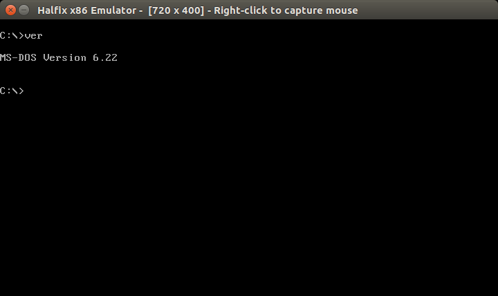
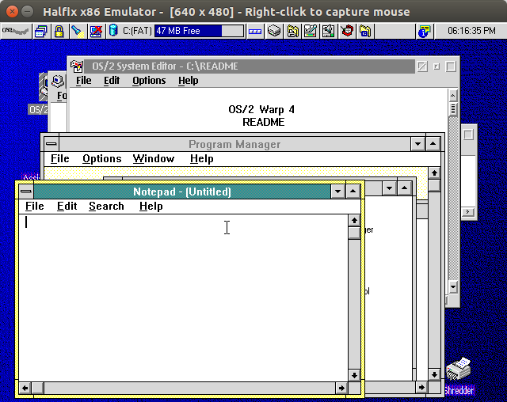
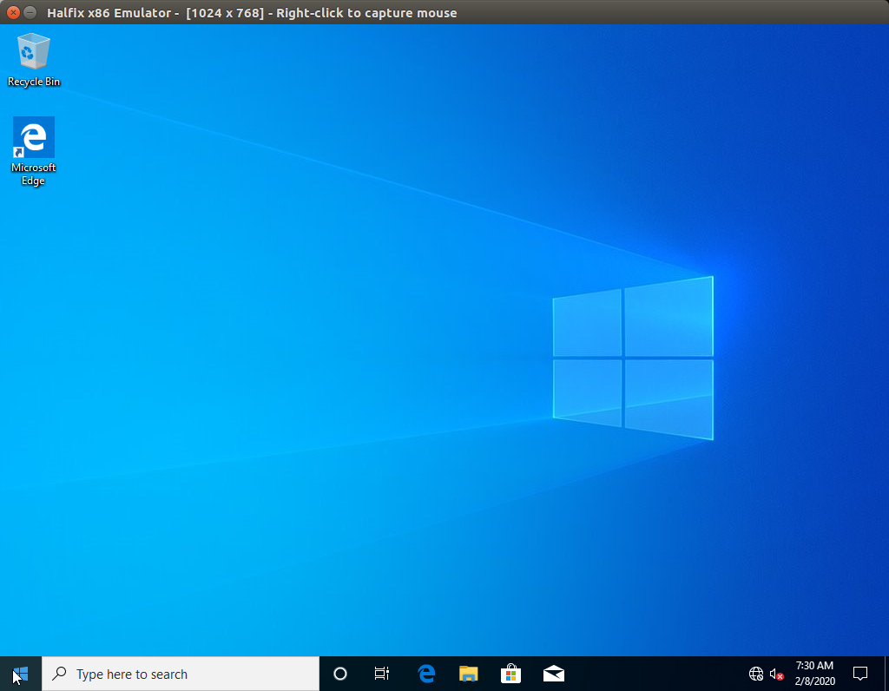
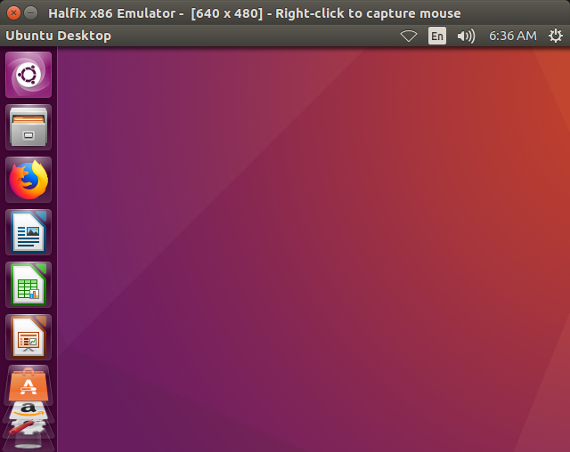

# Halfix x86 emulator

Halfix is a portable x86 emulator written in C99. It allows you to run legacy operating systems on modern platforms. 

## Why?

I made this mostly for fun, and because it was a great way to learn about the x86 PC architecture. On a more practical level, it can be used for:
 - Testing out or developing operating systems
 - Running old programs or operating systems that no longer work on modern computers or you wouldn't want to risk running on your personal computer. 
 - Simulating other x86-based systems (the CPU component can be isolated relatively easily and used in other projects)
 - Testing web browser performance

## Building and Running

You will need `node.js`, a C99-compatible compiler, `libsdl`, `zlib`, and Emscripten (only if you're targeting the browser). Make sure that the required libraries are in a place where the compiler can get them. No prior configuration is required. 

For debug builds, run `node makefile.js` without any arguments. For a debug Emscripten build, pass `emscripten` to the file. For release builds, run `node makefile.js release`. 

It is recommended -- but not required -- that you chunk up the disk images. Run `node tools/imgsplit.js [path-to-your-disk-image]` and modify the configuration file as required. Note that the Emscripten version only accepts chunked disk images. 

Check the [project wiki](https://github.com/nepx/halfix/wiki) for more details. 

**Summary**:

```
 $ node makefile.js release
 $ node tools/imgsplit.js os.img
 $ ./halfix
```

## Emulated Hardware

 - 32-bit x86 CPU, Pentium 4-compatible (FPU, MMX, SSE, SSE2, SSE3 planned)
 - Intel 8259 Programmable Interrupt Controller
 - Intel 8254 Programmable Interval Timer
 - Intel 8237 Direct Memory Access Controller
 - Intel 8042 "PS/2" Controller with attached keyboard and mouse
 - Generic VGA graphics card with Bochs VBE extensions
 - Generic IDE controller (hard drive and CD-ROM)
 - i440FX chipset (this doesn't work quite so well yet)
 - Intel 82093AA I/O APIC
 - Dummy PC speaker (no sound)
 - Floppy drive controller (incomplete)

## Compatibility

It boots a wide range of operating system software, including all versions of DOS, most versions of Windows (excluding Windows 8), newer versions of OS/2 Warp (3 and 4.5), ReactOS, and some varieties of Linux (ISO Linux, Damn Small Linux, Red Star OS 2, Buildroo, Ubuntu). 

See [Compatibility](compatibility.md) for more details.

## Self-Virtualization

Can you run the emulator inside the emulator? 

Yes, but not very quickly. 


Host: Ubuntu 16.04

Guest: Windows XP SP2

Guest 2: Windows 98 SE

## Screenshots

MS-DOS



OS/2 Warp 4.5



Windows Vista


Windows 7 (Note: CMOS date mistake)


The same Windows 98 disk image as in the [Halfix in Halfix screenshot](docs/pics/halfix-in-halfix.png) running in Firefox


CPU-Z on Windows XP


Windows 10



Ubuntu



## Transferring Files

Create a directory with all the files you want to transfer and create an ISO image. 

```
mkisofs -o programs.iso -max-iso9660-filenames -iso-level 4 programs/
```

Now update the configuration file as follows:

```
# Note: it does not hae to be ata0-slave. 
# I have not tested it with anything but ata0-slave.
[ata0-slave]
inserted=1
type=cd
file=/tmp/programs.iso
driver=sync
```

Now boot up your operating system and copy the files from the CD-ROM to the hard drive. 

## License

GNU General Public License version 3

## Similar Projects

 - [v86](https://www.github.com/copy/v86)
 - [JSLinux](http://bellard.org/jslinux/)
 - [jemul8](http://www.github.com/asmblah/jemul8)

## Credits

The FPU emulator uses an modified version of [Berkeley SoftFloat](jhauser.us/arithmetic/SoftFloat.html) from the [Bochs](bochs.sourceforge.net) emulator. 